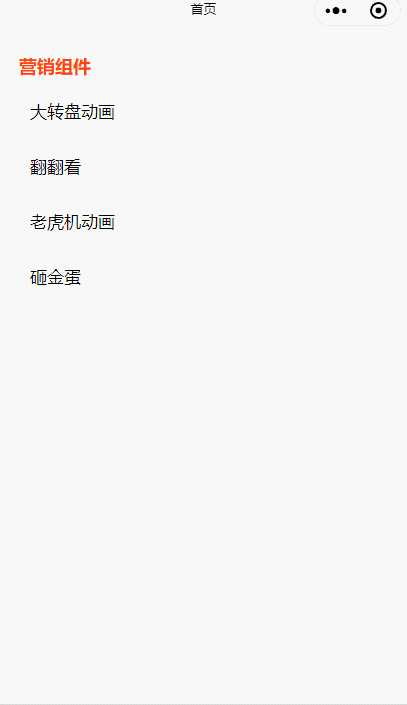

# Weapp-Marketing-components

基于 taro   纯css3动画做的营销组件 适用于小程序，代码清晰，简单好用。

### Build Setup

```
# 克隆到本地
git clone https://github.com/Rachel-lj/Weapp-Marketing-components.git

# 安装依赖
npm install

# 编译项目生成dist文件
npm run dev:weapp

# 然后打开微信开发者工具添加dist文件可以看到效果
```

<u>对你有帮助的话，请 star 一下吧</u>

### 项目截图




